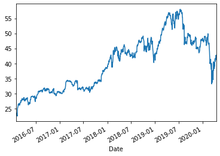
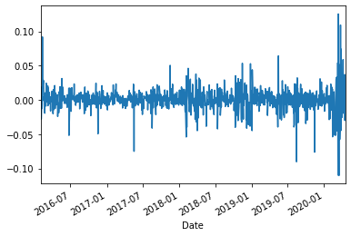
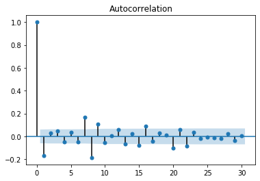
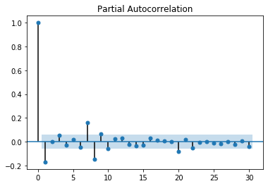
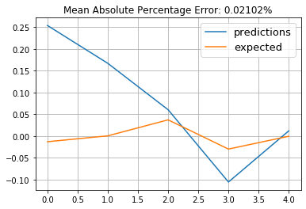
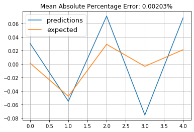
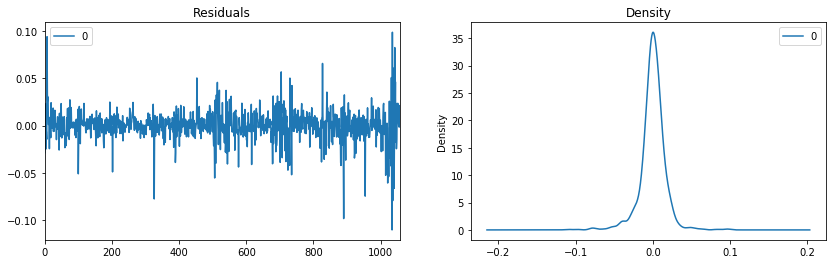
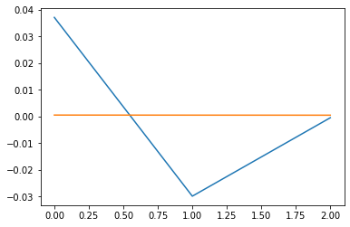

```python
import numpy as np
import pandas as pd
import yfinance as fyf
import statsmodels.tsa. stattools
import statsmodels.tsa.api as smt

from pandas import read_csv
from matplotlib import pyplot
from statsmodels.tsa.arima_model import ARIMA
from sklearn.metrics import mean_squared_error
from math import sqrt

stocks='CSCO'
stocks=stocks.split()
data= fyf.download(stocks, start = '2016-02-01', end = '2020-04-17')['Close']
data.tail()
```

    [*********************100%***********************]  1 of 1 completed


    Date
    2020-04-09    41.200001
    2020-04-13    41.220001
    2020-04-14    42.779999
    2020-04-15    41.520000
    2020-04-16    41.500000
    Name: Close, dtype: float64


Загружаем цены акций компании Cisco. 


```python
len(data)
```


    1060


```python
data.plot()
```


    <matplotlib.axes._subplots.AxesSubplot at 0x136bdfe50>




Ряд не стационарен, поэтому берем первую разность значений.

```python
am = data
ram=np.log(am).diff().dropna()
ram.plot()
```


    <matplotlib.axes._subplots.AxesSubplot at 0x137319290>





Построим модель ARIMA для прогнозирования цены акций. 
Строим графики ACF и PACF для определения порядка AR и MA в модели. 


```python
from statsmodels.graphics.tsaplots import plot_acf
plot_acf(ram, lags=30,alpha=0.05).show()
```

    /opt/anaconda3/lib/python3.7/site-packages/ipykernel_launcher.py:2: UserWarning: Matplotlib is currently using module://ipykernel.pylab.backend_inline, which is a non-GUI backend, so cannot show the figure.
      





```python
from statsmodels.graphics.tsaplots import plot_pacf
plot_pacf(ram, lags=30,alpha=0.05).show()
```

    /opt/anaconda3/lib/python3.7/site-packages/ipykernel_launcher.py:2: UserWarning: Matplotlib is currently using module://ipykernel.pylab.backend_inline, which is a non-GUI backend, so cannot show the figure.
      





```python
from statsmodels.tsa.stattools import adfuller
adfuller(ram)
```


    (-10.565359105633611,
     7.54156140584926e-19,
     9,
     1049,
     {'1%': -3.4365991650067502,
      '5%': -2.864299173128419,
      '10%': -2.5682390922672735},
     -5616.93890453926)


Тест Дики-Фуллера подтверждает, что интегрированный ряд первого порядка стационарен. 


```python
from statsmodels.tsa.stattools import arma_order_select_ic as seic
os=seic(ram,max_ar=3,max_ma=3,ic='aic')
```

    /opt/anaconda3/lib/python3.7/site-packages/statsmodels/tsa/tsatools.py:689: RuntimeWarning: overflow encountered in exp
      newparams = ((1-np.exp(-params))/(1+np.exp(-params))).copy()
    /opt/anaconda3/lib/python3.7/site-packages/statsmodels/tsa/tsatools.py:689: RuntimeWarning: invalid value encountered in true_divide
      newparams = ((1-np.exp(-params))/(1+np.exp(-params))).copy()
    /opt/anaconda3/lib/python3.7/site-packages/statsmodels/tsa/tsatools.py:690: RuntimeWarning: overflow encountered in exp
      tmp = ((1-np.exp(-params))/(1+np.exp(-params))).copy()
    /opt/anaconda3/lib/python3.7/site-packages/statsmodels/tsa/tsatools.py:690: RuntimeWarning: invalid value encountered in true_divide
      tmp = ((1-np.exp(-params))/(1+np.exp(-params))).copy()


```python
print (os)
```

    {'aic':              0            1            2            3
    0 -5626.404613 -5654.042479 -5654.118489 -5653.337947
    1 -5655.336368 -5653.336458 -5670.672503 -5678.379000
    2 -5653.336517 -5677.950806 -5694.307525 -5697.537908
    3 -5654.643496 -5680.970902 -5697.098683 -5691.320740, 'aic_min_order': (2, 3)}


По результам подбора наилучшая модель - ARMA(2,3). 


```python
!pip install pmdarima
```

    Requirement already satisfied: pmdarima in /opt/anaconda3/lib/python3.7/site-packages (1.5.3)
    Requirement already satisfied: pandas>=0.19 in /opt/anaconda3/lib/python3.7/site-packages (from pmdarima) (0.25.1)
    Requirement already satisfied: scikit-learn>=0.22 in /opt/anaconda3/lib/python3.7/site-packages (from pmdarima) (0.22.2.post1)
    Requirement already satisfied: joblib>=0.11 in /opt/anaconda3/lib/python3.7/site-packages (from pmdarima) (0.13.2)
    Requirement already satisfied: scipy>=1.3.2 in /opt/anaconda3/lib/python3.7/site-packages (from pmdarima) (1.4.1)
    Requirement already satisfied: statsmodels>=0.10.2 in /opt/anaconda3/lib/python3.7/site-packages (from pmdarima) (0.11.1)
    Requirement already satisfied: numpy>=1.17.3 in /opt/anaconda3/lib/python3.7/site-packages (from pmdarima) (1.18.2)
    Requirement already satisfied: urllib3 in /opt/anaconda3/lib/python3.7/site-packages (from pmdarima) (1.24.2)
    Requirement already satisfied: Cython>=0.29 in /opt/anaconda3/lib/python3.7/site-packages (from pmdarima) (0.29.17)
    Requirement already satisfied: pytz>=2017.2 in /opt/anaconda3/lib/python3.7/site-packages (from pandas>=0.19->pmdarima) (2019.3)
    Requirement already satisfied: python-dateutil>=2.6.1 in /opt/anaconda3/lib/python3.7/site-packages (from pandas>=0.19->pmdarima) (2.8.0)
    Requirement already satisfied: patsy>=0.5 in /opt/anaconda3/lib/python3.7/site-packages (from statsmodels>=0.10.2->pmdarima) (0.5.1)
    Requirement already satisfied: six>=1.5 in /opt/anaconda3/lib/python3.7/site-packages (from python-dateutil>=2.6.1->pandas>=0.19->pmdarima) (1.12.0)


```python
#max_lag=30
rm1=smt.ARMA(ram,order=(2,3)).fit(method ='mle')
rm1.summary()
```

    /opt/anaconda3/lib/python3.7/site-packages/statsmodels/tsa/base/tsa_model.py:218: ValueWarning: A date index has been provided, but it has no associated frequency information and so will be ignored when e.g. forecasting.
      ' ignored when e.g. forecasting.', ValueWarning)


<table class="simpletable">
<caption>ARMA Model Results</caption>
<tr>
  <th>Dep. Variable:</th>       <td>Close</td>      <th>  No. Observations:  </th>   <td>1059</td>   
</tr>
<tr>
  <th>Model:</th>            <td>ARMA(2, 3)</td>    <th>  Log Likelihood     </th> <td>2855.769</td> 
</tr>
<tr>
  <th>Method:</th>               <td>mle</td>       <th>  S.D. of innovations</th>   <td>0.016</td>  
</tr>
<tr>
  <th>Date:</th>          <td>Tue, 28 Apr 2020</td> <th>  AIC                </th> <td>-5697.538</td>
</tr>
<tr>
  <th>Time:</th>              <td>19:39:06</td>     <th>  BIC                </th> <td>-5662.782</td>
</tr>
<tr>
  <th>Sample:</th>                <td>0</td>        <th>  HQIC               </th> <td>-5684.365</td>
</tr>
<tr>
  <th></th>                       <td> </td>        <th>                     </th>     <td> </td>    
</tr>
</table>
<table class="simpletable">
<tr>
       <td></td>          <th>coef</th>     <th>std err</th>      <th>z</th>      <th>P>|z|</th>  <th>[0.025</th>    <th>0.975]</th>  
</tr>
<tr>
  <th>const</th>       <td>    0.0005</td> <td>    0.000</td> <td>    1.177</td> <td> 0.239</td> <td>   -0.000</td> <td>    0.001</td>
</tr>
<tr>
  <th>ar.L1.Close</th> <td>   -1.8285</td> <td>    0.020</td> <td>  -92.717</td> <td> 0.000</td> <td>   -1.867</td> <td>   -1.790</td>
</tr>
<tr>
  <th>ar.L2.Close</th> <td>   -0.9826</td> <td>    0.019</td> <td>  -51.334</td> <td> 0.000</td> <td>   -1.020</td> <td>   -0.945</td>
</tr>
<tr>
  <th>ma.L1.Close</th> <td>    1.7056</td> <td>    0.038</td> <td>   45.340</td> <td> 0.000</td> <td>    1.632</td> <td>    1.779</td>
</tr>
<tr>
  <th>ma.L2.Close</th> <td>    0.7746</td> <td>    0.060</td> <td>   12.909</td> <td> 0.000</td> <td>    0.657</td> <td>    0.892</td>
</tr>
<tr>
  <th>ma.L3.Close</th> <td>   -0.0783</td> <td>    0.034</td> <td>   -2.327</td> <td> 0.020</td> <td>   -0.144</td> <td>   -0.012</td>
</tr>
</table>
<table class="simpletable">
<caption>Roots</caption>
<tr>
    <td></td>   <th>            Real</th>  <th>         Imaginary</th> <th>         Modulus</th>  <th>        Frequency</th>
</tr>
<tr>
  <th>AR.1</th> <td>          -0.9305</td> <td>          -0.3898j</td> <td>           1.0088</td> <td>          -0.4369</td>
</tr>
<tr>
  <th>AR.2</th> <td>          -0.9305</td> <td>          +0.3898j</td> <td>           1.0088</td> <td>           0.4369</td>
</tr>
<tr>
  <th>MA.1</th> <td>          -0.9666</td> <td>          -0.3815j</td> <td>           1.0392</td> <td>          -0.4402</td>
</tr>
<tr>
  <th>MA.2</th> <td>          -0.9666</td> <td>          +0.3815j</td> <td>           1.0392</td> <td>           0.4402</td>
</tr>
<tr>
  <th>MA.3</th> <td>          11.8208</td> <td>          -0.0000j</td> <td>          11.8208</td> <td>          -0.0000</td>
</tr>
</table>


```python
from statsmodels.tsa.arima_model import ARIMA
model=ARIMA(ram,order=(2,0,3))
model_fit=model.fit(disp=0)
print(model_fit.summary())
```

    /opt/anaconda3/lib/python3.7/site-packages/statsmodels/tsa/base/tsa_model.py:218: ValueWarning: A date index has been provided, but it has no associated frequency information and so will be ignored when e.g. forecasting.
      ' ignored when e.g. forecasting.', ValueWarning)


                                  ARMA Model Results                              
    ==============================================================================
    Dep. Variable:                  Close   No. Observations:                 1059
    Model:                     ARMA(2, 3)   Log Likelihood                2855.769
    Method:                       css-mle   S.D. of innovations              0.016
    Date:                Tue, 28 Apr 2020   AIC                          -5697.538
    Time:                        19:39:10   BIC                          -5662.782
    Sample:                             0   HQIC                         -5684.365
                                                                                  
    ===============================================================================
                      coef    std err          z      P>|z|      [0.025      0.975]
    -------------------------------------------------------------------------------
    const           0.0005      0.000      1.177      0.239      -0.000       0.001
    ar.L1.Close    -1.8285      0.020    -92.709      0.000      -1.867      -1.790
    ar.L2.Close    -0.9826      0.019    -51.330      0.000      -1.020      -0.945
    ma.L1.Close     1.7056      0.038     45.339      0.000       1.632       1.779
    ma.L2.Close     0.7746      0.060     12.909      0.000       0.657       0.892
    ma.L3.Close    -0.0783      0.034     -2.327      0.020      -0.144      -0.012
                                        Roots                                    
    =============================================================================
                      Real          Imaginary           Modulus         Frequency
    -----------------------------------------------------------------------------
    AR.1           -0.9305           -0.3898j            1.0088           -0.4369
    AR.2           -0.9305           +0.3898j            1.0088            0.4369
    MA.1           -0.9666           -0.3815j            1.0392           -0.4402
    MA.2           -0.9666           +0.3815j            1.0392            0.4402
    MA.3           11.8205           -0.0000j           11.8205           -0.0000
    -----------------------------------------------------------------------------


```python
resid = model_fit.resid
predictions = []
for i in range(1,6):
        yhat = 0.0005-1.8285*ram[1052+i]-0.9826*ram[1051+i]-0.9666*resid[1052+i]-0.9666*resid[1051+i]+11.8205*resid[1050+i]
        predictions.append(yhat)
predictions
```


    [0.25350435779053476,
     0.1668074955198769,
     0.06030150317180978,
     -0.10546512565950546,
     0.011872378904485783]


```python
test = ram[1054:1059]
error = mean_squared_error(test, predictions)
error
```


    0.02101974365025949


```python
#predictions=pd.DataFrame(predictions)
test = np.array(test)
plt.plot(predictions, label = 'predictions')
plt.plot(test, label = 'expected')
plt.title("Mean Absolute Percentage Error: {0:.5f}%".format(error))
plt.grid(True)
plt.axis('tight')
plt.legend(loc="best", fontsize=13)
plt.show
```


    <function matplotlib.pyplot.show(*args, **kw)>





```python
ram1 = [x for x in ram]
predictions=[]
for i in range(1,6):
        yhat = 0.0005-1.8285*ram1[1057+i]-0.9826*ram1[1056+i]
        predictions.append(yhat)
        ram1.append(yhat)
expected = fyf.download(stocks, start = '2020-04-18', end = '2020-04-25')['Close']
expected = np.log(expected).diff().dropna()
expected
```

    [*********************100%***********************]  1 of 1 completed


    Date
    2020-04-20    0.001411
    2020-04-21   -0.047909
    2020-04-22    0.029403
    2020-04-23   -0.003358
    2020-04-24    0.021394
    Name: Close, dtype: float64


```python
error = mean_squared_error(expected, predictions)
error
```


    0.0020264543206101873


```python
test = np.array(expected)
plt.plot(predictions, label = 'predictions')
plt.plot(test, label = 'expected')
plt.title("Mean Absolute Percentage Error: {0:.5f}%".format(error))
plt.grid(True)
plt.axis('tight')
plt.legend(loc="best", fontsize=13)
plt.show
```


    <function matplotlib.pyplot.show(*args, **kw)>





Теперь строим прогнозы цены акций по модели ARIMA с помощью встроенной функции. Оптимальная модель для волатильности была ARIMA(2,0,3).


```python
from sklearn.metrics import mean_squared_error
train_size=len(ram)-5
train, test=ram[0:train_size],ram[train_size:]
```


```python
history = [x for x in train]
# make predictions
predictions = list()
for t in range(len(test)):
    model = ARIMA(history, order=(2,0,3))
    model_fit = model.fit(disp=0)
    yhat = model_fit.forecast()[0]
    predictions.append(yhat)
    history.append(test[t])
# calculate out of sample error
error = mean_squared_error(test, predictions)
error
```

    /opt/anaconda3/lib/python3.7/site-packages/statsmodels/tsa/tsatools.py:689: RuntimeWarning: overflow encountered in exp
      newparams = ((1-np.exp(-params))/(1+np.exp(-params))).copy()
    /opt/anaconda3/lib/python3.7/site-packages/statsmodels/tsa/tsatools.py:689: RuntimeWarning: invalid value encountered in true_divide
      newparams = ((1-np.exp(-params))/(1+np.exp(-params))).copy()
    /opt/anaconda3/lib/python3.7/site-packages/statsmodels/tsa/tsatools.py:690: RuntimeWarning: overflow encountered in exp
      tmp = ((1-np.exp(-params))/(1+np.exp(-params))).copy()
    /opt/anaconda3/lib/python3.7/site-packages/statsmodels/tsa/tsatools.py:690: RuntimeWarning: invalid value encountered in true_divide
      tmp = ((1-np.exp(-params))/(1+np.exp(-params))).copy()


    0.0003481514602350443


```python
predictions=pd.DataFrame(predictions)
test = np.array(test)
plt.plot(predictions, label = 'predictions')
plt.plot(test, label = 'expected')
plt.title("Mean Absolute Percentage Error: {0:.5f}%".format(error))
plt.grid(True)
plt.axis('tight')
plt.legend(loc="best", fontsize=13)
plt.show
```


    <function matplotlib.pyplot.show(*args, **kw)>


```python
import pmdarima as pm
model=pm.auto_arima(am,start_p=1,start_q=1,test='adf',max_p=7,max_q=7, seasonal = False)
model.summary()
```

    /opt/anaconda3/lib/python3.7/site-packages/statsmodels/tsa/statespace/sarimax.py:963: UserWarning: Non-stationary starting autoregressive parameters found. Using zeros as starting parameters.
      warn('Non-stationary starting autoregressive parameters'
    /opt/anaconda3/lib/python3.7/site-packages/statsmodels/tsa/statespace/sarimax.py:975: UserWarning: Non-invertible starting MA parameters found. Using zeros as starting parameters.
      warn('Non-invertible starting MA parameters found.'


<table class="simpletable">
<caption>SARIMAX Results</caption>
<tr>
  <th>Dep. Variable:</th>           <td>y</td>        <th>  No. Observations:  </th>   <td>1060</td>   
</tr>
<tr>
  <th>Model:</th>           <td>SARIMAX(1, 1, 0)</td> <th>  Log Likelihood     </th> <td>-1100.320</td>
</tr>
<tr>
  <th>Date:</th>            <td>Tue, 28 Apr 2020</td> <th>  AIC                </th> <td>2206.639</td> 
</tr>
<tr>
  <th>Time:</th>                <td>19:39:19</td>     <th>  BIC                </th> <td>2221.535</td> 
</tr>
<tr>
  <th>Sample:</th>                  <td>0</td>        <th>  HQIC               </th> <td>2212.285</td> 
</tr>
<tr>
  <th></th>                      <td> - 1060</td>     <th>                     </th>     <td> </td>    
</tr>
<tr>
  <th>Covariance Type:</th>        <td>opg</td>       <th>                     </th>     <td> </td>    
</tr>
</table>
<table class="simpletable">
<tr>
      <td></td>         <th>coef</th>     <th>std err</th>      <th>z</th>      <th>P>|z|</th>  <th>[0.025</th>    <th>0.975]</th>  
</tr>
<tr>
  <th>intercept</th> <td>    0.0195</td> <td>    0.022</td> <td>    0.892</td> <td> 0.372</td> <td>   -0.023</td> <td>    0.062</td>
</tr>
<tr>
  <th>ar.L1</th>     <td>   -0.1414</td> <td>    0.014</td> <td>   -9.860</td> <td> 0.000</td> <td>   -0.170</td> <td>   -0.113</td>
</tr>
<tr>
  <th>sigma2</th>    <td>    0.4677</td> <td>    0.009</td> <td>   51.105</td> <td> 0.000</td> <td>    0.450</td> <td>    0.486</td>
</tr>
</table>
<table class="simpletable">
<tr>
  <th>Ljung-Box (Q):</th>          <td>115.68</td> <th>  Jarque-Bera (JB):  </th> <td>3098.85</td>
</tr>
<tr>
  <th>Prob(Q):</th>                 <td>0.00</td>  <th>  Prob(JB):          </th>  <td>0.00</td>  
</tr>
<tr>
  <th>Heteroskedasticity (H):</th>  <td>7.98</td>  <th>  Skew:              </th>  <td>-0.63</td> 
</tr>
<tr>
  <th>Prob(H) (two-sided):</th>     <td>0.00</td>  <th>  Kurtosis:          </th>  <td>11.28</td> 
</tr>
</table><br/><br/>Warnings:<br/>[1] Covariance matrix calculated using the outer product of gradients (complex-step).


### Рассмотрим автокорреляцию остатков. 


```python
import matplotlib.pyplot as plt
residuals = pd.DataFrame(model_fit.resid)
fig, ax = plt.subplots(1,2)
residuals.plot(title="Residuals", ax=ax[0])
residuals.plot(kind='kde', title='Density', ax=ax[1],figsize=(14,4))
plt.show()
```





```python
residuals.tail()
```


<div>
<style scoped>
    .dataframe tbody tr th:only-of-type {
        vertical-align: middle;
    }

    .dataframe tbody tr th {
        vertical-align: top;
    }

    .dataframe thead th {
        text-align: right;
    }
</style>
<table border="1" class="dataframe">
  <thead>
    <tr style="text-align: right;">
      <th></th>
      <th>0</th>
    </tr>
  </thead>
  <tbody>
    <tr>
      <td>1053</td>
      <td>0.003223</td>
    </tr>
    <tr>
      <td>1054</td>
      <td>-0.001347</td>
    </tr>
    <tr>
      <td>1055</td>
      <td>0.001873</td>
    </tr>
    <tr>
      <td>1056</td>
      <td>0.021174</td>
    </tr>
    <tr>
      <td>1057</td>
      <td>-0.001274</td>
    </tr>
  </tbody>
</table>
</div>


```python
residuals=np.array(residuals)
residuals
```


    array([[-0.02862861],
           [ 0.00386041],
           [ 0.02295968],
           ...,
           [ 0.00187279],
           [ 0.02117383],
           [-0.00127435]])


```python
from statsmodels.stats.stattools import durbin_watson
dw = durbin_watson(residuals)
dw
```


    array([1.99363851])


Тест Дарбина-Вотсона показал, что автокорреляция в остатках отсутствует (статистика почти равна двум). 
Проверим на наличие автокорреляции квадраты остатков.


```python
squarred_resid = np.square(residuals)
dw = durbin_watson(squarred_resid)
dw 
```


    array([1.11198092])


Тест Дарбина-Вотсона показал, что присутствует автокорреляция в квадратах. Это прямое указание на то, что нужно строить модель GARCH.


```python
rap=np.log(am).diff().dropna()
rap.plot()
```


    <matplotlib.axes._subplots.AxesSubplot at 0x13758f950>


```python
!pip install arch 
from arch import arch_model
```

    Requirement already satisfied: arch in /opt/anaconda3/lib/python3.7/site-packages (4.14)
    Requirement already satisfied: cython>=0.29.14 in /opt/anaconda3/lib/python3.7/site-packages (from arch) (0.29.17)
    Requirement already satisfied: property-cached>=1.6.3 in /opt/anaconda3/lib/python3.7/site-packages (from arch) (1.6.4)
    Requirement already satisfied: statsmodels>=0.9 in /opt/anaconda3/lib/python3.7/site-packages (from arch) (0.11.1)
    Requirement already satisfied: numpy>=1.14 in /opt/anaconda3/lib/python3.7/site-packages (from arch) (1.18.2)
    Requirement already satisfied: pandas>=0.23 in /opt/anaconda3/lib/python3.7/site-packages (from arch) (0.25.1)
    Requirement already satisfied: scipy>=1.0.1 in /opt/anaconda3/lib/python3.7/site-packages (from arch) (1.4.1)
    Requirement already satisfied: patsy>=0.5 in /opt/anaconda3/lib/python3.7/site-packages (from statsmodels>=0.9->arch) (0.5.1)
    Requirement already satisfied: pytz>=2017.2 in /opt/anaconda3/lib/python3.7/site-packages (from pandas>=0.23->arch) (2019.3)
    Requirement already satisfied: python-dateutil>=2.6.1 in /opt/anaconda3/lib/python3.7/site-packages (from pandas>=0.23->arch) (2.8.0)
    Requirement already satisfied: six in /opt/anaconda3/lib/python3.7/site-packages (from patsy>=0.5->statsmodels>=0.9->arch) (1.12.0)


```python
rap_train = rap[:-3]
rap_test = rap[-3:]

garch11=arch_model(rap_train,p=1,q=1)
res=garch11.fit(update_freq=10)
#print(res.summary)
```

    Optimization terminated successfully.    (Exit mode 0)
                Current function value: -3026.1465711194332
                Iterations: 8
                Function evaluations: 82
                Gradient evaluations: 6


    /opt/anaconda3/lib/python3.7/site-packages/arch/univariate/base.py:293: DataScaleWarning: y is poorly scaled, which may affect convergence of the optimizer when
    estimating the model parameters. The scale of y is 0.0002861. Parameter
    estimation work better when this value is between 1 and 1000. The recommended
    rescaling is 100 * y.
    
    This warning can be disabled by either rescaling y before initializing the
    model or by setting rescale=False.
    
      data_scale_warning.format(orig_scale, rescale), DataScaleWarning


Далее прогнозируем волатильность на 3 шага. 


```python
# forecast the test set
yhat = res.forecast(horizon=3)
# plot the actual variance
plt.plot(rap_test.values)
# plot forecast variance
plt.plot(yhat.variance.values[-1, :])
plt.show()
```





```python

```
